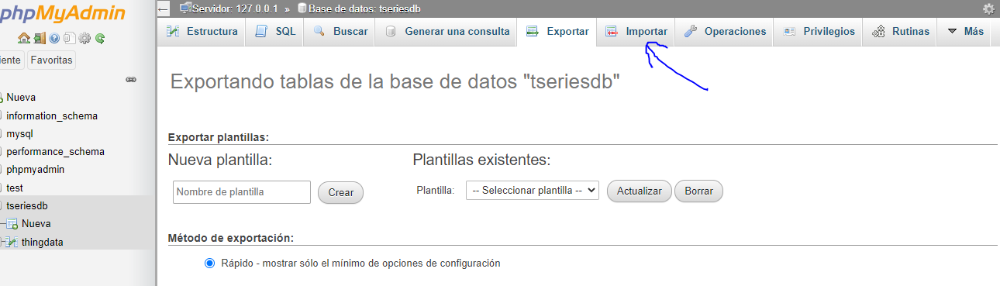
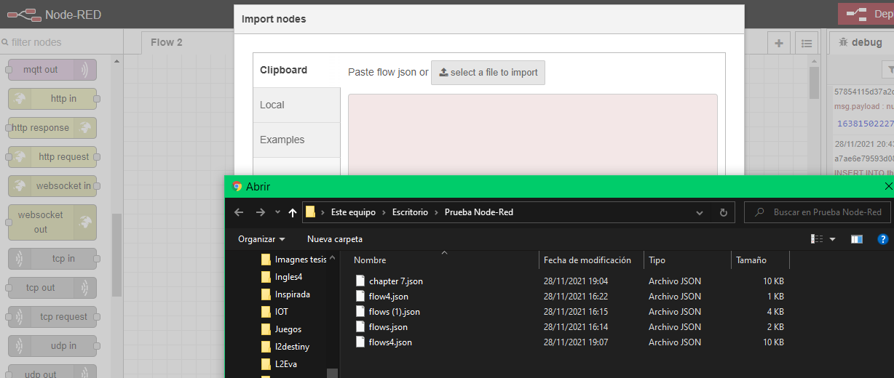
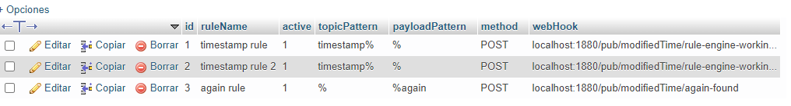
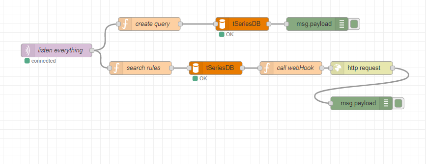
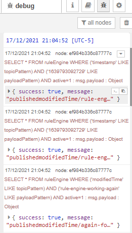
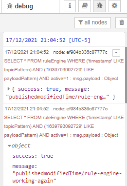
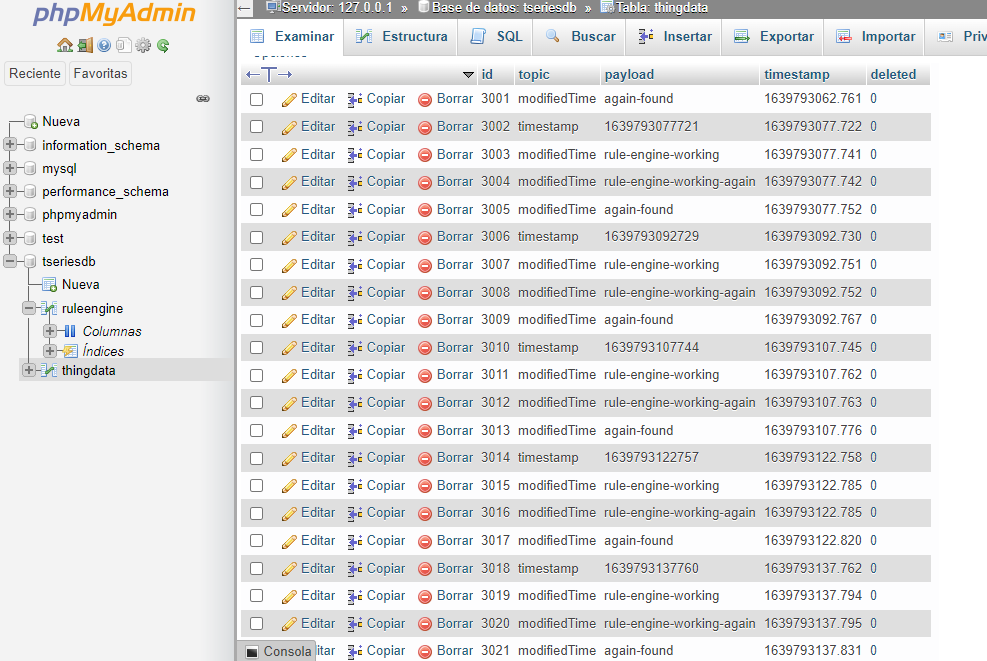

# IOT-Motor-de-reglas - Capitulo 10

Desarrollar la primera parte del Capítulo 10 del libro "Build your own IoT Platform" (páginas 165-171)
Enviar un link del repositorio en GitHub, conteniendo el archivo respectivo en Node RED

## Participantes 
- Diego Antony Gutiérrez Gutiérrez 
## Herramientas 
- [Docker Compose](https://www.docker.com/)
- [Node-Red](https://nodered.org/)
- [Mosquitto](https://mosquitto.org/)

## Ejecutando el proyecto
### Prerequisitos para correr desde docker

- Tener instaldo Mysql
- Tener phpMyAdmin
- Mosquitto 
- Node-Red

#### Importar la base da datos

En nuestro directorio phpMyAdmin importamos el archivo tseriesdb, que esta nuestra base de datos con la cual esta desarrollada esta actividad.

 

#### Importamos a Node-Red
Ahora vamos importar nuestro json a nuestra plantilla en Node-Red. Nuestro json se encuentra en la carpeta node-red-json.

 

### Distribución de nuestro Json Node-Red

 - En los flows Ejemplo1, Ejemplo2, Ejemplo3, Ejemplo4 estas distribuidos los ejemplos realizados en la actividad del Capitulo7.
 - En los flows Chapter9 - Data Access API y Chapter9 - Data Deletion API.
 - En el flow Chapter10 - Se encuentra desarrollada la actividad inicial del capítulo  10.

 ## Estructura de nuestra base de datos 

 En nuestra base de datos se agregaron 3 reglas Timestamp rule, Timestamp rule2 y again rule.

 
 

## Building the Flow Sequence

 
 

## Resultados 
- Node RED - Debug.

 

 

- Se Agregaron nuevos valores en nuestra tabla thingData.

 
